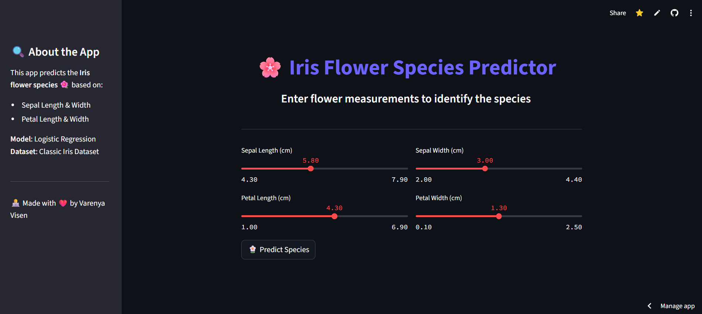

# 🌸 Iris Flower Species Predictor

An elegant and interactive web app that predicts the species of an Iris flower based on four key measurements:  
**Sepal Length**, **Sepal Width**, **Petal Length**, and **Petal Width**.

  

---

## 🔍 About the Project

This Streamlit-based application uses a **Logistic Regression** model to classify iris flowers into three species:

- *Setosa*  
- *Versicolor*  
- *Virginica*

It offers an intuitive slider-based UI to make real-time predictions based on flower measurements.

---

## 🚀 Live Demo

👉 [Click here to view the live app](https://varenyavisen-irisclassifier-app-app-vbrrko.streamlit.app/)

---

## 📊 Dataset

The dataset used is the popular Iris dataset available here:  
📁 [Dropbox Link to Iris Dataset](https://www.dropbox.com/scl/fi/uubmpyj0vtrgkr1rxz5ps/iris.csv?rlkey=54083kkf20vnu5soxpnqegm4a&e=1&st=cq3bl7uj&dl=0)

---

## 🧠 Features

- 📏 Interactive sliders for all input features  
- 🌸 Real-time prediction of iris species  
- 🌙 Clean, dark-themed user interface  
- ⚡ Lightweight and fast  
- 💬 Friendly and readable output

---

## 🛠 Tech Stack

| Technology       | Purpose                                |
|------------------|-----------------------------------------|
| Python           | Programming language                   |
| Pandas           | Data loading & preprocessing           |
| Scikit-learn     | Logistic Regression model              |
| Streamlit        | Web UI & deployment                    |
| Pickle           | Model serialization                    |

---
